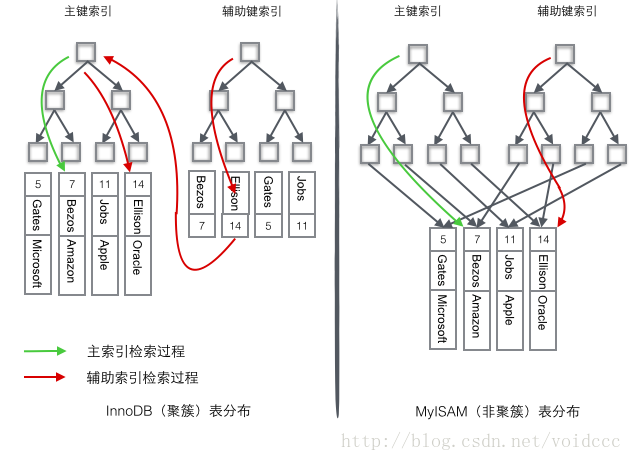
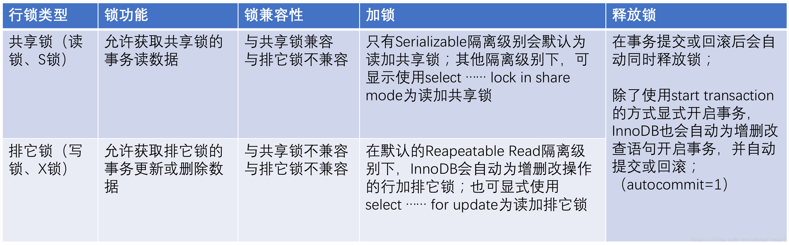
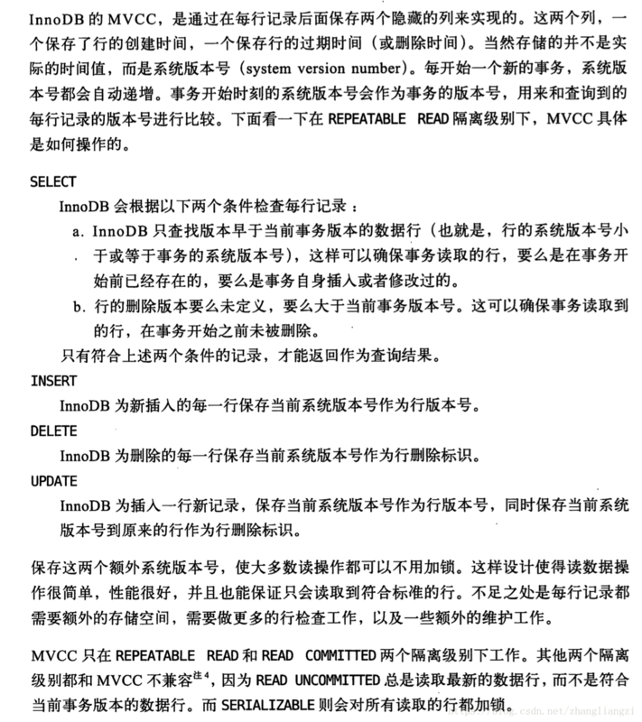

## 基本描述

* Mysql的数据库引擎之一，目前是默认存储引擎

* 区别于ISAM和MyISAM，最大的特色是支持ACID兼容的事物功能

  > **事务管理（ACID）**
  >
  > - 原子性（Atomicity）:指事务是一个不可分割的工作单位，事务中的操作要么都发生，要么都不发生
  > - 一致性（Consistency）:事务前后数据的完整性必须保持一致
  > - 隔离性（Isolation）:事务的隔离性是多个用户并发访问数据库时，数据库为每一个用户开启的事务，不能被其他事务的操作数据所干扰，多个并发事务之间要相互隔离
  > - 持久性（Durability）:指一个事务一旦被提交，它对数据库中数据的改变就是永久性的，接下来即使数据库发生故障也不应该对其有任何影响

* 聚簇索引、最小支持行及锁、支持外键、支持事物（MyISAM是非聚簇索引、最小支持表级锁、不支持外键、不支持事物）

  

## 数据结构

* 使用了B+树
* 区别于B树的优势
  - data都在叶子节点，查找数据IO次数少（磁盘IO一次读出的数据量大小是固定的，单个数据变大，每次读出的就少，IO次数增多，一次IO多耗时啊！）
  - 由于data都在叶子节点，可以遍历叶子节点进行范围查询

* 区别于红黑树的优势
  - 红黑树的深度过大导致IO读写过于频繁，B+树可以有多个子节点，更少的层级就更少的IO次数


## 事物隔离级别

| 隔离级别         | 脏读（Dirty Read） | 不可重复读（NonRepeatable Read） | 幻读（Phantom Read） |
| ---------------- | ------------------ | -------------------------------- | -------------------- |
| Read Uncommitted | 可能               | 可能                             | 可能                 |
| Read Committed   | 不可能             | 可能                             | 可能                 |
| Repeatable Read  | 不可能             | 不可能                           | 可能                 |
| Serializable     | 不可能             | 不可能                           | 不可能               |

* 脏读(Drity Read)：某个事务已更新一份数据，另一个事务在此时读取了同一份数据，由于某些原因，前一个发生RollBack了操作，则后一个事务所读取的数据就会是不正确的。
* 不可重复读(Non-repeatableread)：在一个事务的两次查询之中数据不一致，这可能是两次查询过程中间插入了一个事务更新了原有的数据。
* 幻读(Phantom Read):当对某行执行插入或删除操作，而该行属于某个事务正在读取的行的范围时，会发生幻像读问题。事务第一次读的行范围显示出其中一行已不复存在于第二次读或后续读中，因为该行已被其它事务删除。同样，由于其它事务的插入操作，事务的第二次或后续读显示有一行已不存在于原始读中。幻读其实也应该算是一种不可重复读现象，只是它只是相对于insert和delete操作，而上面的不可重复读现象但注重的是update操作。这里这样称呼的原因是insert的新的row是没有版本信息的，它要通过一个范围来确定。

### Read Uncommitted（读取未提交内容）

      在该隔离级别，所有事务都可以看到其他未提交事务的执行结果。本隔离级别很少用于实际应用，因为它的性能也不比其他级别好多少。读取未提交的数据，也被称之为脏读（Dirty Read）。

### Read Committed（读取提交内容）

      这是大多数数据库系统的默认隔离级别（但不是MySQL默认的）。它满足了隔离的简单定义：一个事务只能看见已经提交事务所做的改变。这种隔离级别也支持所谓的不可重复读（Nonrepeatable Read），因为同一事务的其他实例在该实例处理其间可能会有新的commit，所以同一select可能返回不同结果。

### Repeatable Read（可重读）

      这是MySQL的默认事务隔离级别，它确保同一事务的多个实例在并发读取数据时，会看到同样的数据行。不过理论上，这会导致另一个棘手的问题：幻读（Phantom Read）。简单的说，幻读指当用户读取某一范围的数据行时，另一个事务又在该范围内插入了新行，当用户再读取该范围的数据行时，会发现有新的“幻影” 行。InnoDB和Falcon存储引擎通过多版本并发控制（MVCC，Multiversion Concurrency Control 间隙锁）机制解决了该问题。注：其实多版本只是解决不可重复读问题，而加上间隙锁（也就是它这里所谓的并发控制）才解决了幻读问题。

### Serializable（可串行化）

```
这是最高的隔离级别，它通过强制事务排序，使之不可能相互冲突，从而解决幻读问题。简言之，它是在每个读的数据行上加上共享锁。在这个级别，可能导致大量的超时现象和锁竞争
```

## 锁



* 行锁算法都是基于索引实现的，锁定的也都是索引或索引区间

### 当前读

> 即加锁读，读取记录的最新版本，会加锁保证其他并发事务不能修改当前记录，直至获取锁的事务释放锁；

* 使用当前读的操作主要包括：显式加锁的读操作与插入/更新/删除等写操作，如下所示：

```
select * from table where ? lock in share mode;
select * from table where ? for update;
insert into table values (…);
update table set ? where ?;
delete from table where ?;
```

### 快照读

> 即不加锁读，读取记录的快照版本而非最新版本，通过MVCC实现；

* InnoDB默认的RR事务隔离级别下，不显式加『lock in share mode』与『for update』的『select』操作都属于快照读，保证事务执行过程中只有第一次读之前提交的修改和自己的修改可见，其他的均不可见；

### MVCC(多版本并发控制)

> 好处：读不加任何锁，读写不冲突，对于读操作多于写操作的应用，极大的增加了系统的并发性能；

