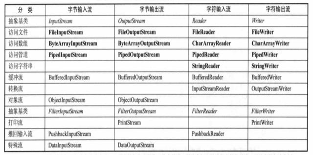

## 基本描述

> java.io : 对文件进行了抽象，基于字符流(**InputStream/OutputStream**) 和 字节流(**Reader/Writer**)作为基类进行IO

- FileInputStream/FileOutputStream  需要逐个字节处理原始二进制流的时候使用，效率低下
- FileReader/FileWriter 需要组个字符处理的时候使用
- StringReader/StringWriter 需要处理字符串的时候，可以将字符串保存为字符数组
- PrintStream/PrintWriter 用来包装FileOutputStream 对象，方便直接将String字符串写入文件 
- Scanner　用来包装System.in流，很方便地将输入的String字符串转换成需要的数据类型
- InputStreamReader/OutputStreamReader ,  字节和字符的转换桥梁，在网络通信或者处理键盘输入的时候用
- BufferedReader/BufferedWriter ， BufferedInputStream/BufferedOutputStream ， 缓冲流用来包装字节流后者字符流，提升IO性能，BufferedReader还可以方便地读取一行，简化编程。

## 字节流和字符流的区别

* 读写单位不同：字节流以字节（8 bit）为单位，字符流以字符为单位，根据码表映射字符，一次可能读多个字节。

* 处理对象不同：字节流能处理所有类型的数据（如图片、avi 等），而字符流只能处理字符类型的数据。

* 字节流没有缓冲区，是直接输出的，而字符流是输出到缓冲区的。因此在输出时，字节流不调用 colse() 方法时，信息已经输出了，而字符流只有在调用 close() 方法关闭缓冲区时，信息才输出。要想字符流在未关闭时输出信息，则需要手动调用 flush() 方法。