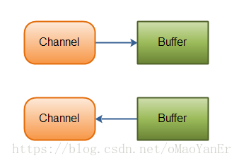
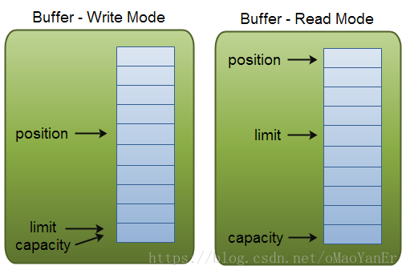
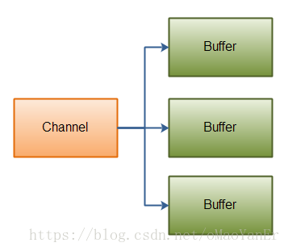
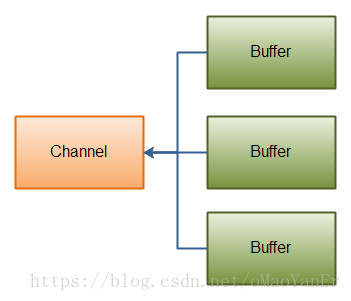
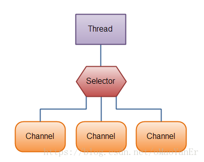

## 基本描述

> NIO主要有Channel(通道)，Buffer(缓冲区), Selector(选择器)三大核心部分。
>
> 传统IO基于字节流和字符流进行操作，而NIO基于Channel和Buffer进行操作，数据从Channel读取到Buffer中，或者从Buffer写入到Channel中
>
> Selector用户监听多个Channel的事件(比如:连接打开、数据到达)，因此单个线程可以监听多个Channel

* 与IO的区别:IO面向流，NIO面向缓冲区

## Channel(通道)

> Channel和IO中的Stream(流)是差不多一个等级的。
>
> 只不过Stream是单向的，譬如：InputStream/OutputStream.而Channel是双向的，既可以用来进行读操作，又可以用来进行写操作



## Buffer(缓冲区)

> 可以将Buffer看做内存中的一块区域，我们可以在这块区域上写数据，然后在从中读取。这块内存区域被包装成NIO Buffer对象，提供了一系列的方法使我们操作这块内存变得更简单一些



### capacity

> 作为一块内存，buffer必须有一个固定容量，这就是buffer的capacity。你最多只能写入capacity容量的数据到buffer中，一旦buffer中被写满数据，在你写入新的数据之前需要置空buffer（通过读取数据或直接清空）

### position

> 当写入buffer数据的时候需要明确写入的位置，这就是position，buffer初始化的时候position为0；当你写入一个字节或者整型数字后，position指针会移动到已经写入数据的内存的下一个内存位置，position的最大值为capacity-1；
> 当读取数据的时候，你也可以给定 一个position，当你调用filp()方法将一个buffer从写模式切换到读模式的时候，position会重置为0，你将会从0位置开始读取数据，读取数据后position也会移动到已读取数据的下一个位置

### limit

> 在写数据的时候，limit限制了写入数据的最大容量即position的最大值（position < limit）.在写模式下，limit=capacity；
> 从上边代码可以看到当调用flip()切换到读模式时，limit被设置为已写入数据的position值，限制你能读取数据的容量，也就是说你最多能读取你写入的所有的数据

### Scatter

> 分散：从一个Channel中分散读取数据到一个或多个Buffer的操作，一次Channel将数据分散到多个Buffer中

```java
ByteBuffer header = ByteBuffer.allocate(128);
ByteBuffer body = ByteBuffer.allocate(1024);

ByteBuffer[] buffers = { header, body };

channel.read(buffers);
```

> 当channel的read()方法传入多个buffer时，会按顺序写入到多个buffer中，第一个buffer写满后，写入下一个，依次直至写满所有buffer



### Gather

> 聚集：将一个或多个Buffer中的数据写入一个Channel中，一次Channel可以从多个Buffer中收集数据

```java
ByteBuffer header = ByteBuffer.allocate(128);
ByteBuffer body = ByteBuffer.allocate(1024);

// 写入数据
ByteBuffer[] bufferArray = { header, body };
channel.write(bufferArray);
```

> 当channel的write()方法传入多个buffer时，会按顺序将多个buffer中的数据依次写入channel，第一个buffer写满后，写入下一个，依次直至写满所有buffer
>
> write()操作只会写入buffer中已写入的数据，即position到limit之间的数据；例如一个buffer的容量为128字节，但buffer中只写入了28字节的数据，只有这28个字节会写入channel中



## Selector(选择器)

> Selector是Java NIO中用于管理一个或多个Channel的组件，控制决定对哪些Channel进行读写；通过使用Selector让一个单线程可以管理多个Channel甚至多个网络连接 -- 控制多路复用

