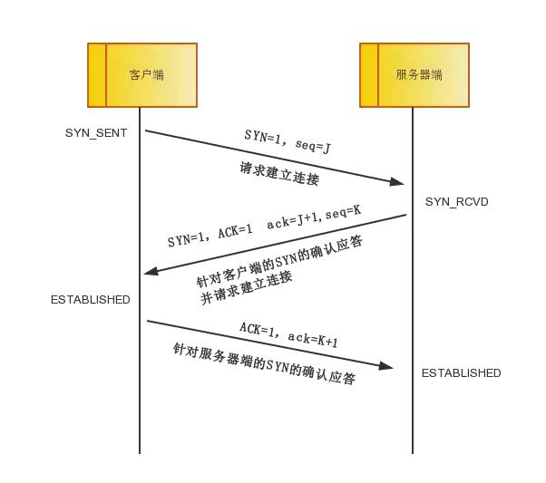

## 基本描述

* http协议全称：HyperText Transfer Protocol，超文本传输协议；用于服务传输超文本到本地浏览器的传送协议
* 应用层协议、C/S模型、无状态
* 通常承载与TCP协议层上，有时也承载与TLS或SSL协议层上，此时成了https

## 工作流程

* 首先客户端和服务端先**建立连接(TCP三次握手)**
* 建立连接后，客户端发送请求给服务端，请求格式为：统一资源标识符（**URL**）、协议版本号，后边是**MIME**信息包括请求修饰符、客户机信息和可能的内容

* 服务器接到请求后返回响应信息，其格式为一个状态行，包括信息的协议版本号、一个成功或错误的代码，后边是**MIME**信息包括服务器信息、实体信息和可能的内容
* 客户端收到响应后**断开连接(TCP四次挥手)**

### 建立连接-TCP三次握手

> ACK : 确认序号有效 
>
> SYN：发送一个新的链接

* 第一次握手：客户端向服务端发出连接请求，将标志位SYN置为1，随机产生一个值seq=J；客户端进入SYN_SENT状态，等待服务器端确认
* 第二次握手：服务端响应客户端，并要求确认，将标志位SYN和ACK都置为1，ack=J+1，随机产生一个值seq=K；服务器端进入SYN_RCVD状态
* 第三次握手：客户端校验(ack==J+1 && ACK==1)，校验通过将标志位ACK置为1，ack=K+1响应服务端；服务端收到后校验(ack==K+1 && ACK==1)，校验通过连接建立成功；客户端、服务端进入ESTABLISHED状态，完成三次握手

#### 为什么三次握手

> 客户端：C，服务端：S
>
> 第一次：C向S请求，此时C什么都不知道，S知道C发送正常，自己接收正常
>
> 第二次：S向C响应，此时C知道自己和S收/发正常，S知道C发送正常，自己接收正常
>
> 第三次：C向S响应，此时C知道自己和S收/发正常，S知道自己和C收/发正常

### 断开连接-TCP四次挥手

> 断开连接可以是客户端也可以是服务端发起
>
> FIN：释放一个链接

* 第一次挥手：客户端向服务端发出断开请求，将标志位FIN置为M；客户端进入FIN_WAIT_1状态
* 第二次挥手：服务端响应客户端，发送ack=M+1；客户端进入FIN_WAIT_2状态
* 第三次挥手：服务端向客户端发送请求，将标志位FIN置为N；服务端进入LAST_ACK状态
* 第四次挥手：客户端响应服务端，发送ack=N+1; 客户端进入TIME_WAIT状态，等待2MSL后没后收到回复证明服务端已关闭连接，此时客户端就关闭连接完成四次挥手

#### 为什么四次挥手

> 客户端：C，服务端：S
>
> 第一次：C向S请求，C不再发送数据了，但是还能接收
>
> 第二次：S向C响应，S确认收到请求，但是还有数据要发送
>
> 第三次：S向C请求，S数据发完了，可以关闭了
>
> 第四次：C向S响应，C确认收到请求，等待超时关闭；S收到响应后立即关闭
>
> - 2MSL时间可以保证本次连接所有报文失效