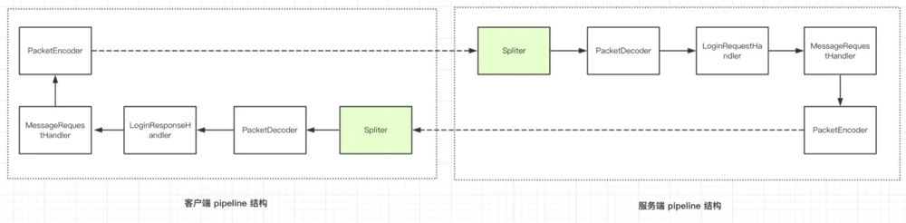

掘金课程：[Netty 入门与实战：仿写微信 IM 即时通讯系统](https://juejin.cn/book/6844733738119593991)

对照项目：[flash-netty](https://github.com/lightningMan/flash-netty.git)

**自定义通信协议：**

首位开始依次是 4个字节的魔数，1个字节的版本号，1个字节的序列化算法，1个字节的指令，4个字节的数据长度，N个字节的数据内容

**客户端与服务端pipeline：**

TODO

慕课网：[Java读源码之Netty深入剖析](https://coding.imooc.com/class/chapter/230.html#Anchor)