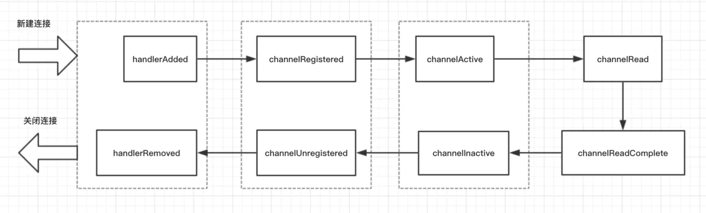
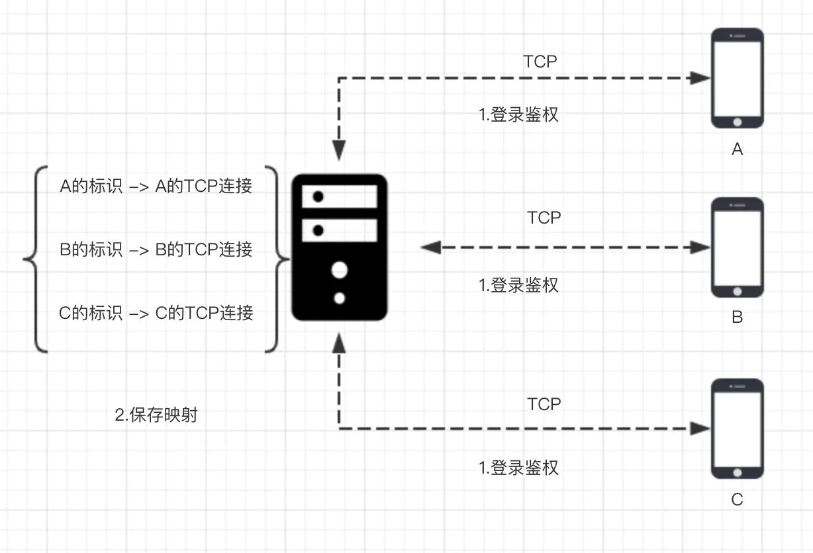

掘金课程：[Netty 入门与实战：仿写微信 IM 即时通讯系统](https://juejin.cn/book/6844733738119593991)

慕课网课程：[Java读源码之Netty深入剖析](https://coding.imooc.com/class/chapter/230.html#Anchor)

对照项目：[flash-netty](https://github.com/lightningMan/flash-netty.git)

## 自定义通信协议

> 首位开始依次是 4个字节的魔数，1个字节的版本号，1个字节的序列化算法，1个字节的指令，4个字节的数据长度，N个字节的数据内容

## 客户端与服务端pipeline

## ChannelHandler 的生命周期

* 客户端建立连接
> handlerAdded() -> channelRegistered() -> channelActive()
> * handlerAdded() ：指的是当检测到新连接之后，调用 ch.pipeline().addLast(new LifeCyCleTestHandler()); 之后的回调，表示在当前的 channel 中，已经成功添加了一个 handler 处理器。
> * channelRegistered()：这个回调方法，表示当前的 channel 的所有的逻辑处理已经和某个 NIO 线程建立了绑定关系。
> * channelActive()：当 channel 的所有的业务逻辑链准备完毕（也就是说 channel 的 pipeline 中已经添加完所有的 handler）以及绑定好一个 NIO 线程之后，这条连接算是真正激活了，接下来就会回调到此方法。
 
* 客户端发送数据
> channelRead() -> channelReadComplete()
> * channelRead()：客户端向服务端发来数据，每次都会回调此方法，表示有数据可读。
> * channelReadComplete()：服务端每次读完一次完整的数据之后，回调该方法，表示数据读取完毕。

* 客户端关闭(channel关闭)
> channelInactive() -> channelUnregistered() -> handlerRemoved()
> * channelInactive(): 表面这条连接已经被关闭了，这条连接在 TCP 层面已经不再是 ESTABLISH 状态了
> * channelUnregistered(): 既然连接已经被关闭，那么与这条连接绑定的线程就不需要对这条连接负责了，这个回调就表明与这条连接对应的 NIO 线程移除掉对这条连接的处理
> * handlerRemoved()：最后，我们给这条连接上添加的所有的业务逻辑处理器都给移除掉。

### ChannelInitializer
> ChannelInitializer 其实就利用了 Netty 的 handler 生命周期中 channelRegistered() 与 handlerAdded() 两个方法
> * ChannelInitializer 定义了一个抽象的方法 initChannel()，这个抽象方法由我们自行实现，我们在服务端启动的流程里面的实现逻辑就是往 pipeline 里面塞我们的 handler 链
> * handlerAdded() 和 channelRegistered() 方法，都会尝试去调用 initChannel() 方法，initChannel() 使用 putIfAbsent() 来防止 initChannel() 被调用多次
> * 如果你 debug 了 ChannelInitializer 的上述两个方法，你会发现，在 handlerAdded() 方法被调用的时候，channel 其实已经和某个线程绑定上了，所以，就我们的应用程序来说，这里的 channelRegistered() 其实是多余的，那为什么这里还要尝试调用一次呢？我猜测应该是担心我们自己写了个类继承自 ChannelInitializer，然后覆盖掉了 handlerAdded() 方法，这样即使覆盖掉，在 channelRegistered() 方法里面还有机会再调一次 initChannel()，把我们自定义的 handler 都添加到 pipeline 中去。

### handlerAdded() 与 handlerRemoved()
> 这两个方法通常可以用在一些资源的申请和释放

### channelActive() 与 channelInActive()
* 对我们的应用程序来说，这两个方法表明的含义是 TCP 连接的建立与释放，通常我们在这两个回调里面统计单机的连接数，channelActive() 被调用，连接数加一，channelInActive() 被调用，连接数减一
* 另外，我们也可以在 channelActive() 方法中，实现对客户端连接 ip 黑白名单的过滤，具体这里就不展开了

### channelRead()
> 解决拆包粘包问题，处理传输数据

### channelReadComplete()
> demo中每次向客户端写数据都通过writeAndFlush() -- 写并刷新 （这种方式并不高效）\
> 可以改成只调用write()，然后在channelReadComplete()里调用ctx.channel().flush()方法，相当于批量刷新 \
> ps: 测试发现客户端关闭时也会调用一次

## 一对一单聊原理

