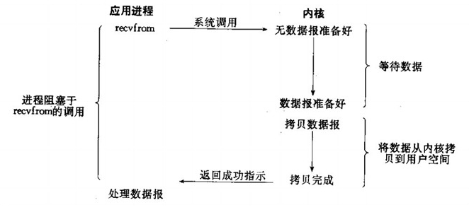
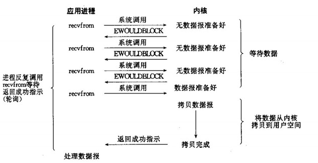

## 基础描述

> IO：一般指访问磁盘数据，分为两个步骤；
>
> 以read操作为例，第一步是等待数据阶段，数据放入系统内核；第二步是从系统内核复制到内存，这里就可以被应用程序使用了；
>
> 网络IO：本质上是socket的读取，socket在Linux系统被抽象为流，IO可以理解为对流的操作
>
> 网络IO读取socket，第一步是等待网络上的数据分组到达，然后被复制到内核某个缓冲区；第二部是把数据从内核缓冲区复制到应用进程缓冲区
>
> Unix有五种I/O模型：阻塞IO、非阻塞IO、多路复用IO、信号驱动式IO、异步IO

## 阻塞IO(bloking IO -- BIO)

* 第一步(等待数据)、第二部(copy数据)都阻塞，比较占用系统资源

## 非阻塞IO(non-blocking IO -- NIO)

* 读取数据时，如果内核中数据没有准备好，直接返回异常；进程收到异常后再次发起读请求
* 在非阻塞IO进程不断轮询内核数据是否准备好

## 多路复用IO(multiplexing IO)

* 当用户进程调用了select，那么整个进程会被block，而同时，kernel会“监视”所有select负责的socket，当任何一个socket中的数据准备好了，select就会返回
* 区别于BIO使用了select、recvfrom两个系统调用，select可以同时处理多个连接
* 如果较少的连接数，select/epoll可能性能低于多线性+BIO；select/epoll优势是可以处理多个连接，单连接的处理速度低于BIO

### select

* 底层数据结构是数组，可监听句柄数量有限制；32位系统默认是1024，64位系统默认是2048
* 对socket进行扫描时，采用轮询方式，不管有哪些socket是活跃的，都遍历一遍，会浪费很多CPU时间
* 内核到进程内存copy数据时，需要复制大量的句柄数据结构，产生很大开销

### poll

* 底层数据结构是链表，没有数量限制
* 除了数据结构外本质上和select没有太大区别

### epoll

> 分为3部分，epoll_create()、epoll_ctl()、epoll_wait()

#### epoll_create()

> 调用epoll_create()建立一个epoll对象（在进程启动时建立）

#### epoll_ctl()

> 调用epoll_ctl向epoll对象中添加N个连接的套接字（新来连接时添加）[删除/修改]
>
> epoll对象有一个独立的eventpoll结构体，使用'红黑树'数据结构存放事件
>
> 每个事件都会与设备(网卡)驱动程序建立回调关系(回调方法:ep_poll_callback)
>
> 回调方法将发生的时间添加到rdlist双向链表中

####epoll_wait()

> 调用epoll_wait收集发生的事件的连接(有数据就绪时会受到callback通知)
>
> 被调用时，检查rdlist双向链表是否有数据

#### 两种模式

* LT：默认模式
  - 某个句柄下如果还有可读数据，epoll_wait就会返回它
* ET：'高速'模式
  - 某个句柄下如果还有可读数据，epoll_wait只会返回一次，直到有新数据流入才再返回一次
  - 使用ET模式时，如果有可读数据，必须要把所有数据读光

## 信号驱动式IO(signal-driven IO)

* 应用进程使用 sigaction 系统调用，内核立即返回，应用进程可以继续执行，也就是说等待数据阶段应用进程是非阻塞的
* 内核在数据准备好后向应用进程发送 SIGIO 信号，应用进程收到之后在信号处理程序中调用 recvfrom 将数据从内核复制到内存

## 异步IO(asynchronous IO -- AIO)

* 异步IO是真正非阻塞的，它不会对请求进程产生任何的阻塞

## 各类IO比较

* **同步IO**指的是真实'操作IO'时候阻塞过程(从内核copy数据到内存中)，阻塞IO、非阻塞IO、复用IO、信号驱动IO都是同步IO，操作IO时都会block进程；**异步IO**操作IO则是异步的IO

