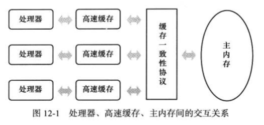

## 基本描述

* volatile用来修饰变量，保证内存可见性及禁止指令重排
* volatile并不能保证原子性，比如i++是3步指令，只有完成3步时才会写入主存，所以并发时会有问题

## 内存可见性

* 缓存一致性问题

  

  >多核处理器涉及到同一共享内存时，将可能导致各自的缓存数据不一致

* java内存模型

  

* 内存可见性

  > 一个处理器对数据修改时，对其他处理器立即可见
  >
  > CPU修改数据, 首先是对缓存的修改, 然后再同步回主存, 在同步回主存的时候, 其他CPU缓存上的(如有)该数据失效, 这样当其他CPU再去它的缓存读取这个数据的时候, 就必须从主存重新获取
  >
  > 实现原理一般是基于CPU的`MESI协议`, 其中E表示`独占`Exclusive, S表示`共享`Shared, M表示`修改`Modify, I表示`无效`Invalid, 如果一个CPU修改了数据, 那么数据状态就会更新为M, 同时其他CPU上的数据状态更新为I, 这个是通过CPU多核之间的嗅探机制实现的

* MESI(缓存一致性)

  > `Modify、Exclusive、Shared、Invalid`, 当CPU写数据时, 如果发现操作的变量是共享变量, 即在其他CPU中也存在该变量的副本, 会发出信号通知其他CPU将该变量的缓存置为无效状态, 因此当其他CPU需要读取这个变量时, 发现自己缓存中缓存的该变量的缓存行是无效的, 那么它就会从内存中重新读取

* 嗅探机制

  >volatile 修饰的变量转换成汇编代码后多了lock修饰
  >
  >lock前缀的指令
  >
  >- 将当前处理器缓存行的数据写回到系统内存(非volatile修饰的并不及时写回)
  >- 这个写回内存的操作会使在其他CPU里缓存了该内存地址的数据无效
  >
  >- 其他处理器会通过缓存一致性协议，通过`嗅探`在总线上传播的数据来检查自己的缓存的值是否过期；当处理器发现自己缓存行对应的内存地址被修改, 就会将当前处理器缓存行设置成无效状态, 当处理器对这个数据进行操作的时候, 会重新从主内存中把数据读到处理器缓存里

## 禁止指令重排

* 当对volatile修饰的属性进行读/写操作时，会在前后插入一条CPU指令(读写栅栏)
* 插入一个读写栅栏 = 告诉CPU & 编译器先于这个命令的必须先执行，后于这个命令的必须后执行（有序性）
* 读写栅栏另一个作用是强制更新一次不同CPU的缓存。例如，一个写栅栏会 把这个栅栏前写入的数据刷新到缓存，以此保证可见性(如上:内存可见性)